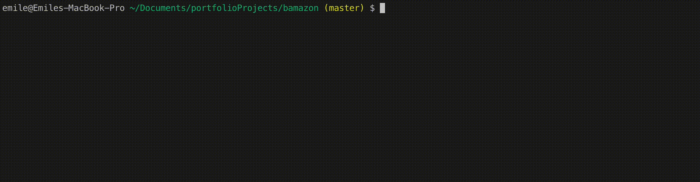
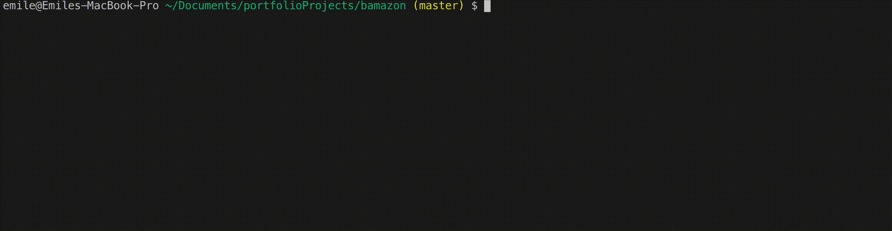

# Bamazon

## Description
This is a command line program built off of node. It allows the user to query for information on movies, songs, and bands in the area via the command line orr by modifying random.txt

## Languages and Modules Used
* Javascript
* Inquiere
* DotEnv
* Shell Script
* Async/Await (made the query.js module functional)

## Instructions
Clone the repo to a local directory. Start up your mysql server via your preferred method. If you do not have mysql installed, go to [MySql](https://dev.mysql.com/downloads/) and install the community server. Then, go to terminal (or powershell or gitbash), cd into the bamazon directory, and run the command ```sh install.sh``` to begin. When you quit out of the prompt, run node bamazon2.js to enter back in to the prompt. **If you rerun install, it will reset the database.**

## Instructional Images
Customer View:


Manager View:


Supervisor View:


## Support
If you come across any bugs or have any suggestions to improve the code, please feel free to comment! I would love to improve the code and I'm very new to writing my own promisies.

## Project Status
This project is part of a web development program I am currently enrolled in and is in the works. I will continue to improve upon it over the next few months. Directions at the moment include: 
* Figuring out why manager and supervisor will quit out of the entire program after you run through the one of the functions
* Cleaning up customer2.js
* Clean up queries to use ? to prevent injection
